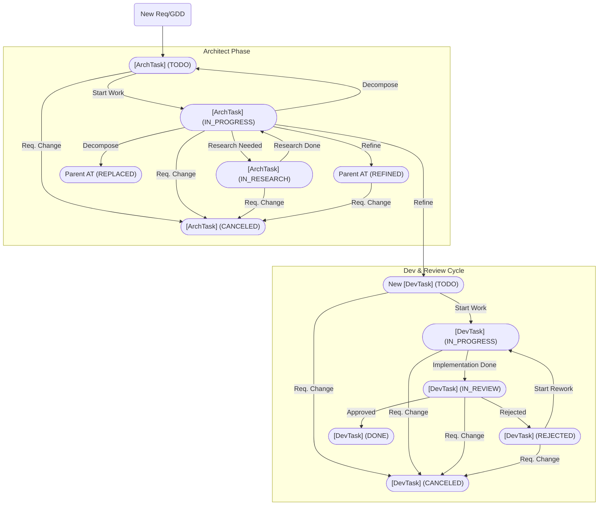

# --- Project Workflow Strategy ---

Universal task lifecycle for Architect, Developer, Reviewer. Tool: **ConPort**. Task type prefix in `log_progress` e.g. `[Architecture Task]` (AT) and `[Developer Task]` (DT)
**"Sprint" Definition:** Work a Developer persona fully implements in one interaction (prompt-response cycle). This defines DT target scope

For details you MUST FULLY read (all 50 lines) `@/.docs/workflow.md`

